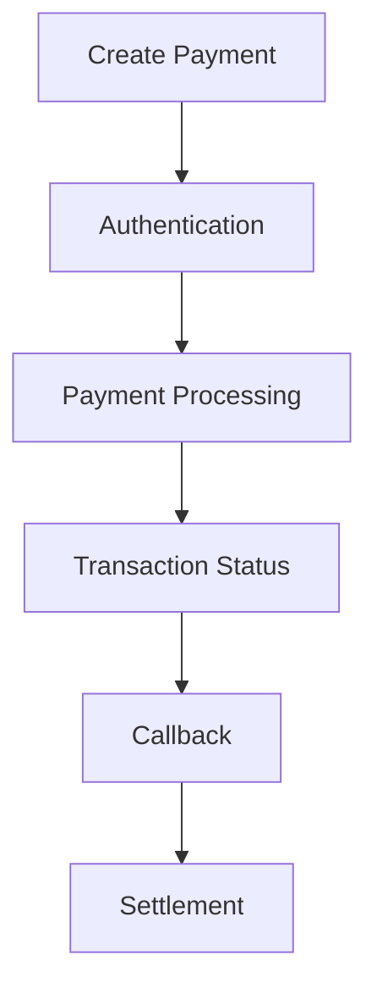
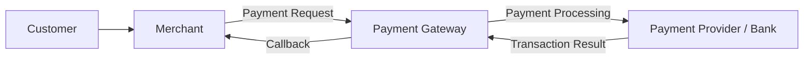
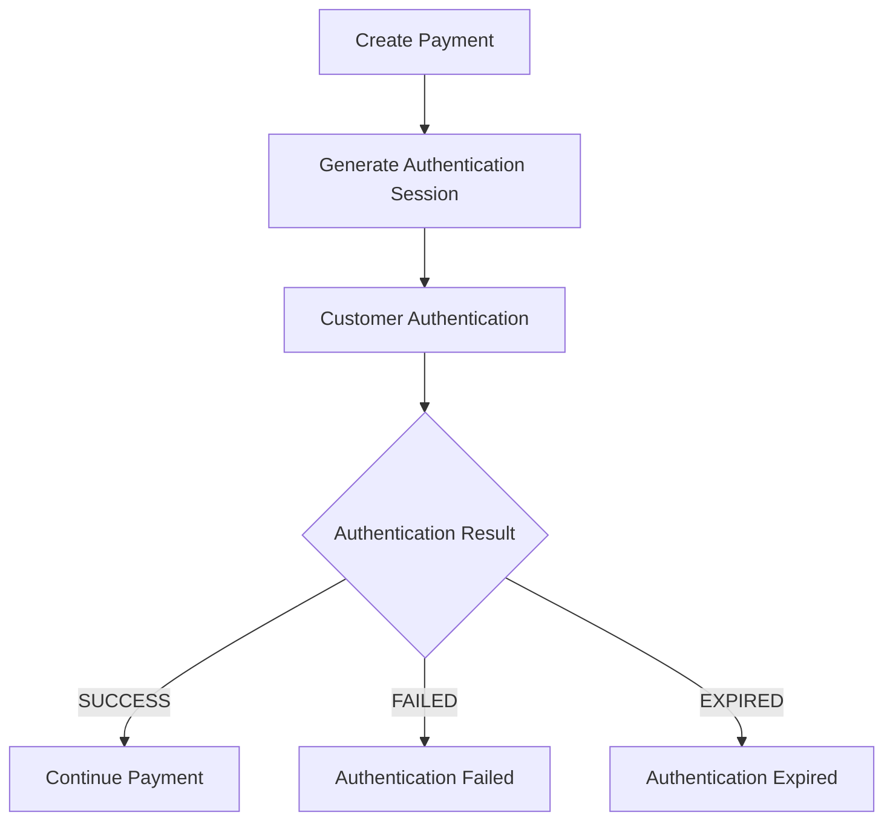
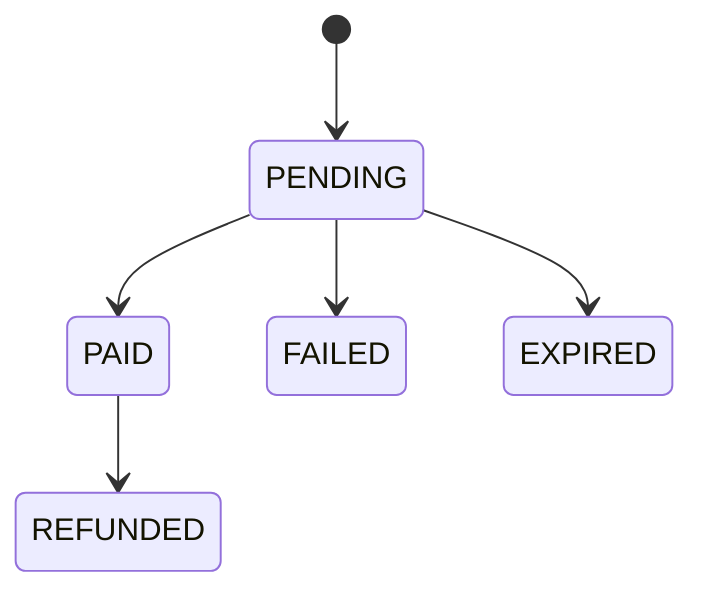
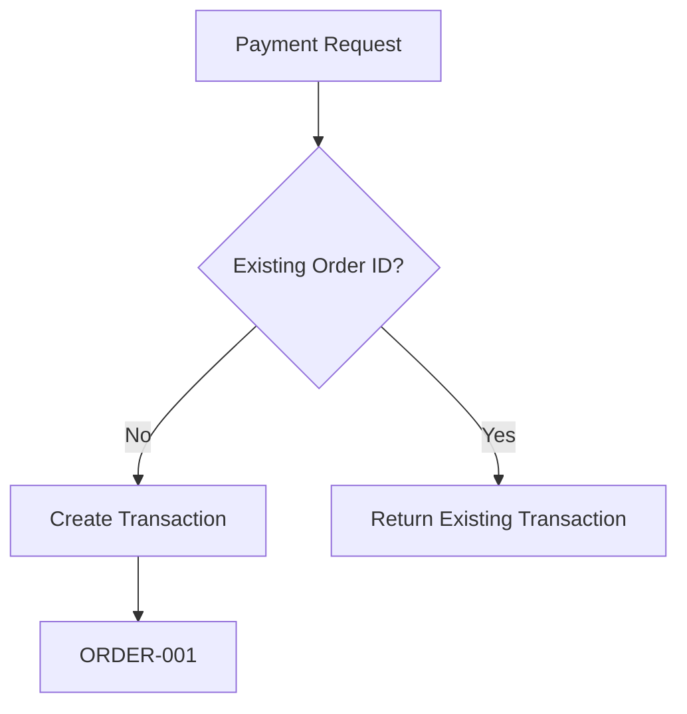
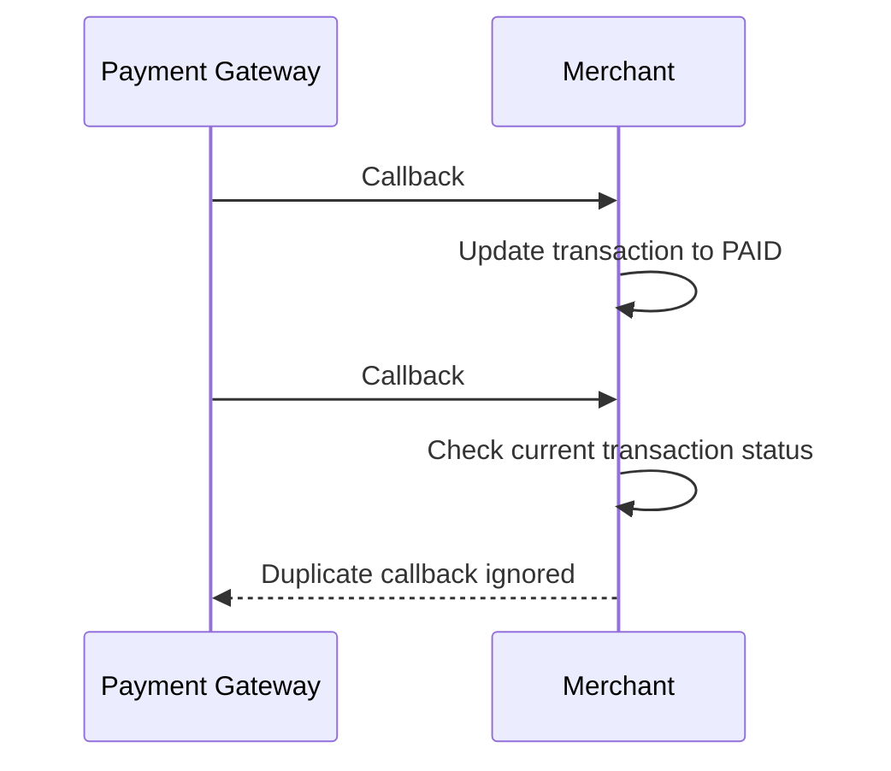
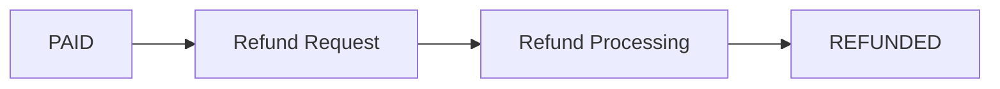
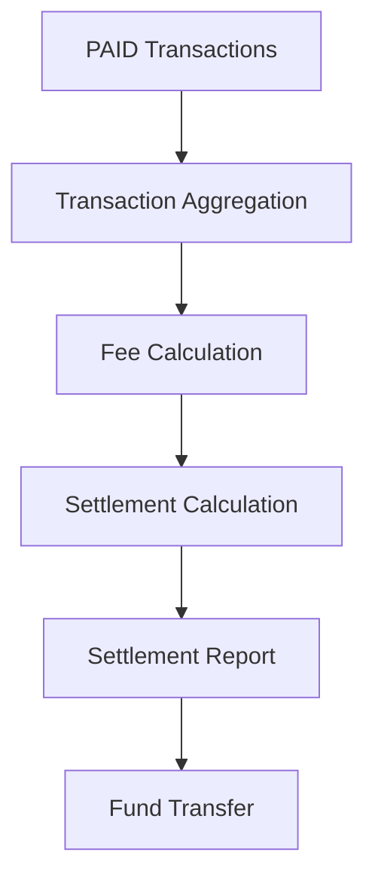
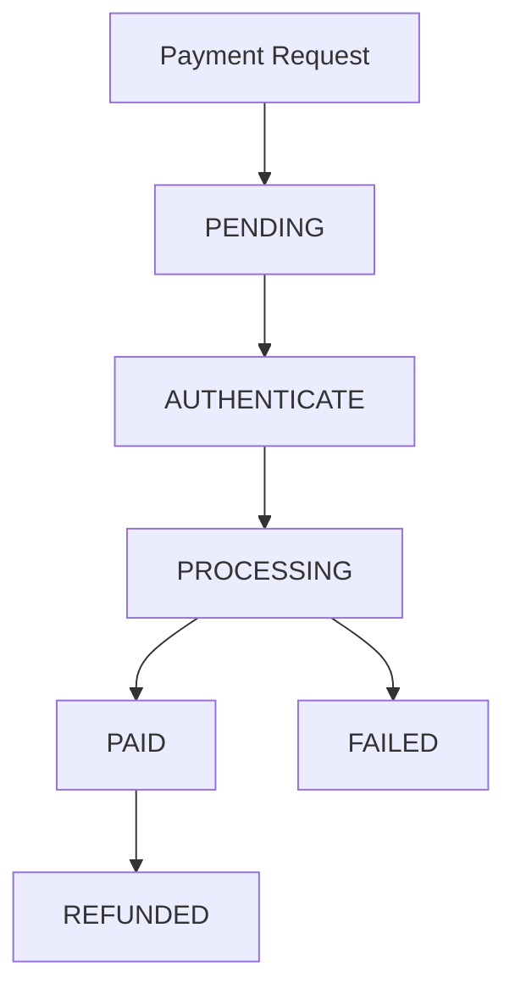

# 💳 Payment Gateway API

A simulated payment gateway portfolio project demonstrating a typical digital payment transaction lifecycle.

This project focuses on payment product concepts, API integration, transaction processing, authentication, callback handling, transaction status, and settlement.

---

## 🎯 Project Overview

The purpose of this project is to demonstrate how a payment transaction can be designed and documented from the initial payment request until the final transaction status.

This project is created as a portfolio example and does not represent any production payment system.

---

## 🔄 Payment Flow



---

## 🏗️ High-Level Architecture



---

## 💰 Create Payment

The merchant sends a payment request to the payment gateway.

### Example Request

```json
{
  "merchantId": "DEMO001",
  "orderId": "ORDER-001",
  "amount": 150000,
  "currency": "IDR"
}
```

### Example Response

```json
{
  "responseCode": "00",
  "status": "PENDING",
  "description": "Payment request has been accepted."
}
```

The `PENDING` status indicates that the payment request has been accepted and is still being processed.

---

## 🔐 Authentication

Some payment methods require customer authentication before the transaction can continue.

### Authentication Flow



Possible authentication results:

| Result | Description |
|---|---|
| SUCCESS | Customer authentication was successful |
| FAILED | Customer authentication failed |
| EXPIRED | Authentication session has expired |

---

## 📊 Transaction Status

A payment transaction can have several states.

| Status | Description |
|---|---|
| PENDING | Transaction is still being processed |
| PAID | Transaction was successfully completed |
| FAILED | Transaction failed |
| EXPIRED | Transaction expired before completion |
| REFUNDED | Transaction was successfully refunded |

### Simplified Transaction State



---

## 🔔 Callback

After the payment provider processes the transaction, the payment gateway can send the transaction result back to the merchant.

### Example Callback

```json
{
  "orderId": "ORDER-001",
  "status": "PAID",
  "amount": 150000,
  "currency": "IDR",
  "transactionId": "TXN-001"
}
```

The merchant can use the callback to update the customer's order status.

---

## ⚠️ Error Handling

The payment system should handle different transaction scenarios.

Examples:

- Invalid payment request
- Invalid authentication session
- Authentication expired
- Transaction failed
- Transaction still pending
- Duplicate callback
- Transaction already completed
- Invalid transaction status

### Example Error Response

```json
{
  "responseCode": "AUTH_01",
  "status": "EXPIRED",
  "description": "Authentication session has expired."
}
```

---

## 🔁 Idempotency

Payment systems should prevent duplicate transaction processing.

For example, if the same payment request is submitted multiple times, the system should identify the existing transaction instead of creating an unintended duplicate payment.



---

## 🔄 Callback Handling

Callbacks may sometimes be delivered more than once.

The system should validate the transaction before updating its final state.



This helps prevent inconsistent transaction states.

---

## 💵 Refund

A successful payment may be eligible for a refund depending on the payment product rules.

### Refund Flow



### Example Response

```json
{
  "responseCode": "00",
  "status": "REFUNDED",
  "description": "Transaction has been refunded."
}
```

---

## 💰 Settlement

Settlement is the process of transferring completed transaction funds to the merchant according to the configured settlement schedule.

A settlement process may include:

1. Transaction validation
2. Transaction aggregation
3. Fee calculation
4. Settlement calculation
5. Settlement report
6. Fund transfer

### Settlement Flow



---

## 🧪 Example Test Scenarios

| Scenario | Expected Result |
|---|---|
| Valid payment request | Payment accepted |
| Invalid amount | Request rejected |
| Authentication success | Continue payment |
| Authentication failed | Payment authentication failed |
| Authentication expired | Authentication expired |
| Payment successful | PAID |
| Payment failed | FAILED |
| Payment timeout | PENDING / EXPIRED |
| Duplicate callback | Duplicate update ignored |
| Successful refund | REFUNDED |

---

## 🧠 Product Considerations

A payment product should consider several areas beyond the basic API flow.

### Reliability

- Transaction consistency
- Callback reliability
- Retry mechanism
- Timeout handling
- Idempotency

### Security

- Authentication
- Session management
- OTP expiration
- Sensitive data protection
- Request validation

### Operations

- Transaction monitoring
- Error monitoring
- Reconciliation
- Settlement reporting
- Incident handling

### Customer Experience

- Clear transaction status
- Meaningful error messages
- Authentication experience
- Payment timeout handling
- Refund visibility

---

## 🛠️ Technical Concepts

This portfolio project demonstrates knowledge of:

- REST API
- JSON
- Payment Gateway
- API Integration
- Authentication
- OTP
- Transaction Lifecycle
- Callback
- Idempotency
- Refund
- Settlement
- Transaction Monitoring

---

## 📌 Example Transaction Lifecycle



---

## 📚 Related Portfolio Topics

This repository can be extended with:

- Payment API Documentation
- Authentication Flow
- Transaction Monitoring
- SQL Examples
- API Testing
- Product Requirements
- User Stories
- Acceptance Criteria
- Payment Architecture

---

## ⚠️ Disclaimer

This is a portfolio project created for demonstration and educational purposes.

It does not contain production credentials, real customer data, real merchant information, or confidential company information.
