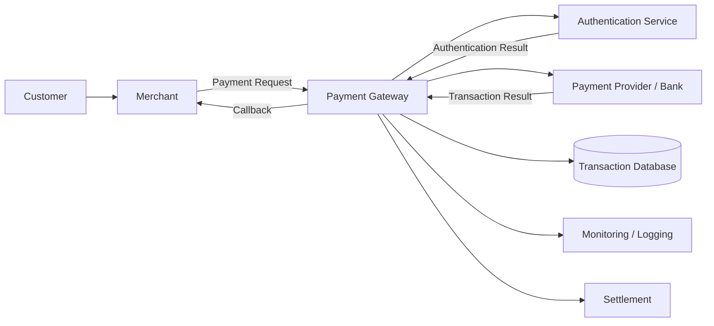
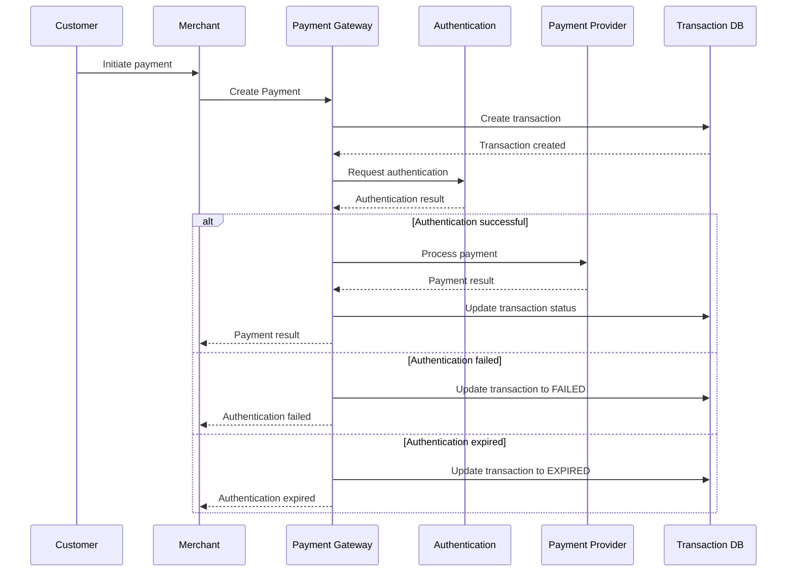
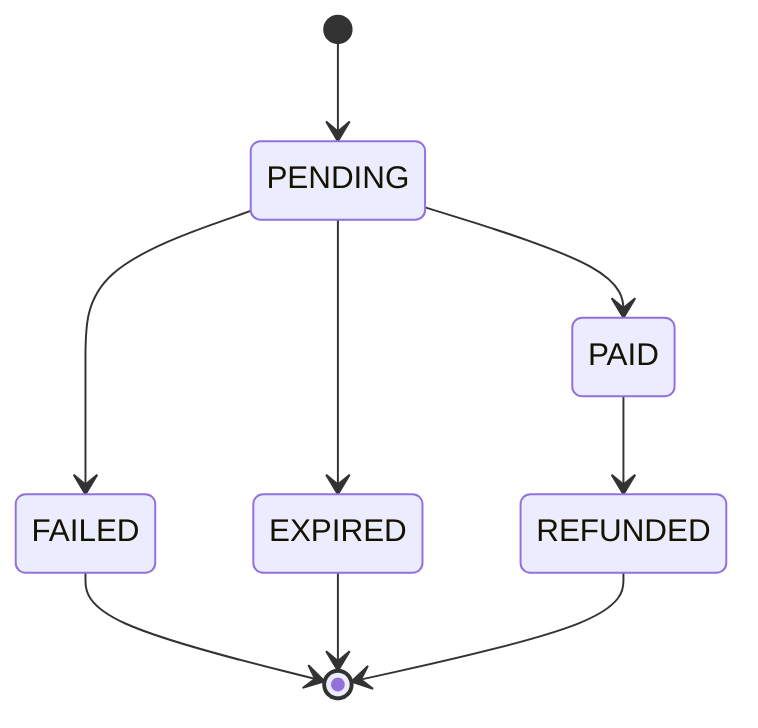
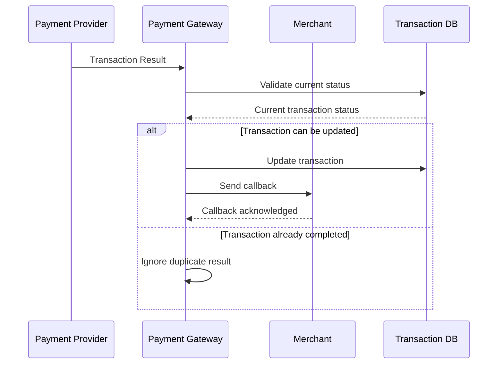

# 🏗️ Payment Gateway Architecture

This document describes the high-level architecture and transaction flow of the simulated payment gateway.

---

## System Architecture



---

## Main Components

### Customer

The customer initiates the payment through the merchant application or checkout page.

### Merchant

The merchant creates the payment request and receives the transaction result from the payment gateway.

### Payment Gateway

The payment gateway acts as the central transaction processing layer.

Responsibilities include:

- Payment request validation
- Transaction creation
- Authentication handling
- Payment processing
- Transaction status management
- Callback handling
- Refund processing
- Settlement processing

### Authentication Service

Handles customer authentication when required by the payment method.

Examples:

- OTP authentication
- Authentication session
- Session expiration
- Authentication result

### Payment Provider / Bank

Processes the actual payment transaction and returns the transaction result.

### Transaction Database

Stores transaction information and transaction state.

Example states:

- PENDING
- PAID
- FAILED
- EXPIRED
- REFUNDED

### Monitoring / Logging

Used to monitor transaction processing and troubleshoot issues.

Example monitoring areas:

- Failed transactions
- Pending transactions
- Callback failures
- Timeout
- Authentication errors
- Integration errors

### Settlement

Handles the settlement process for completed transactions.

---

## Payment Transaction Flow



---

## Transaction State Model



---

## Callback Flow

The payment provider may return the transaction result asynchronously.



---

## Failure Scenarios

A payment system needs to handle failures at different stages.

### Authentication Failure

```text
Create Payment
      ↓
Authentication
      ↓
FAILED
```

### Authentication Expiration

```text
Create Payment
      ↓
Authentication Session
      ↓
Session Timeout
      ↓
EXPIRED
```

### Payment Provider Failure

```text
Payment Gateway
      ↓
Payment Provider
      ↓
Processing Error
      ↓
FAILED
```

### Delayed Transaction Result

```text
Payment Request
      ↓
PENDING
      ↓
Waiting for Provider Result
      ↓
Transaction Result Received
      ↓
Update Final Status
```

---

## Product Considerations

The architecture should support:

- Reliable transaction processing
- Clear transaction states
- Secure authentication
- Idempotent requests
- Duplicate callback handling
- Timeout handling
- Transaction reconciliation
- Operational monitoring
- Settlement consistency

---

## Disclaimer

This architecture is a simplified portfolio example created for demonstration purposes.

It does not represent a production architecture or any specific company's internal system.
